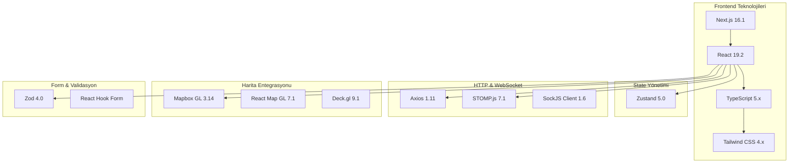
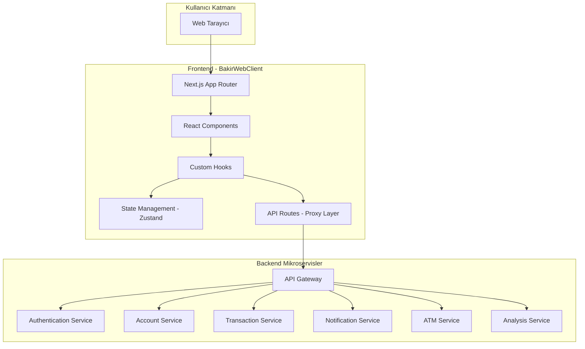
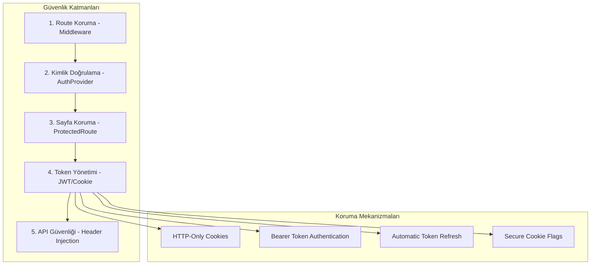
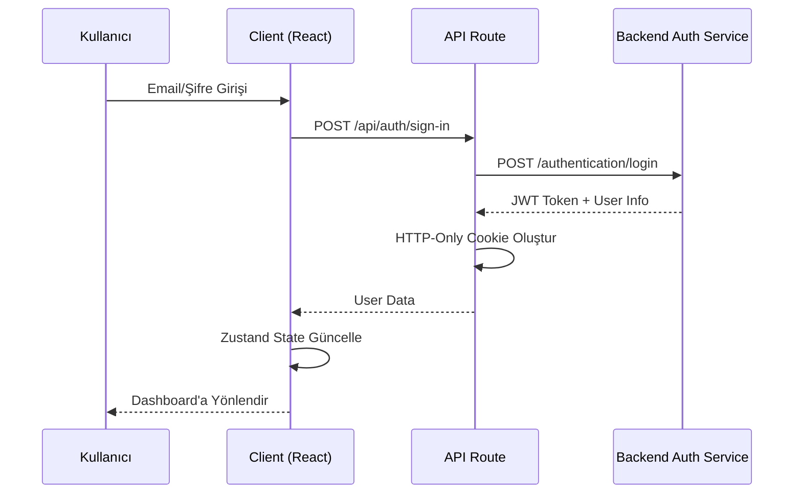
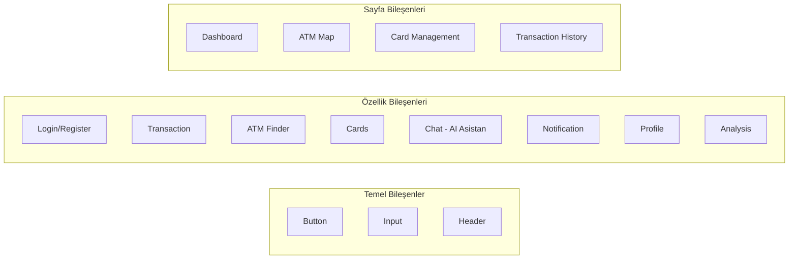
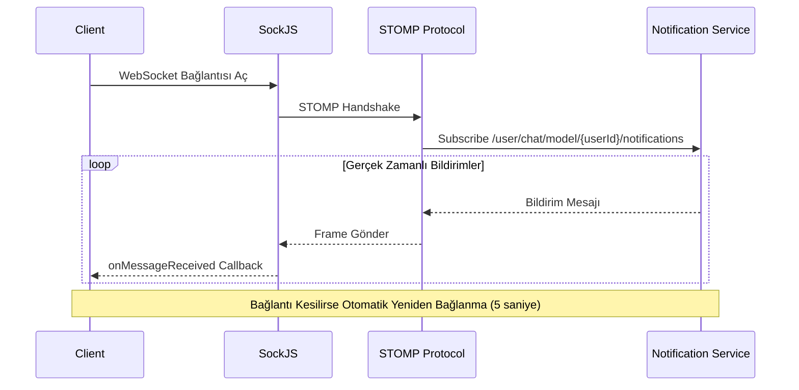
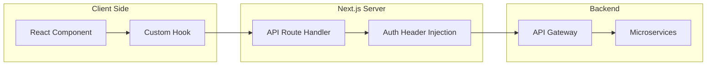
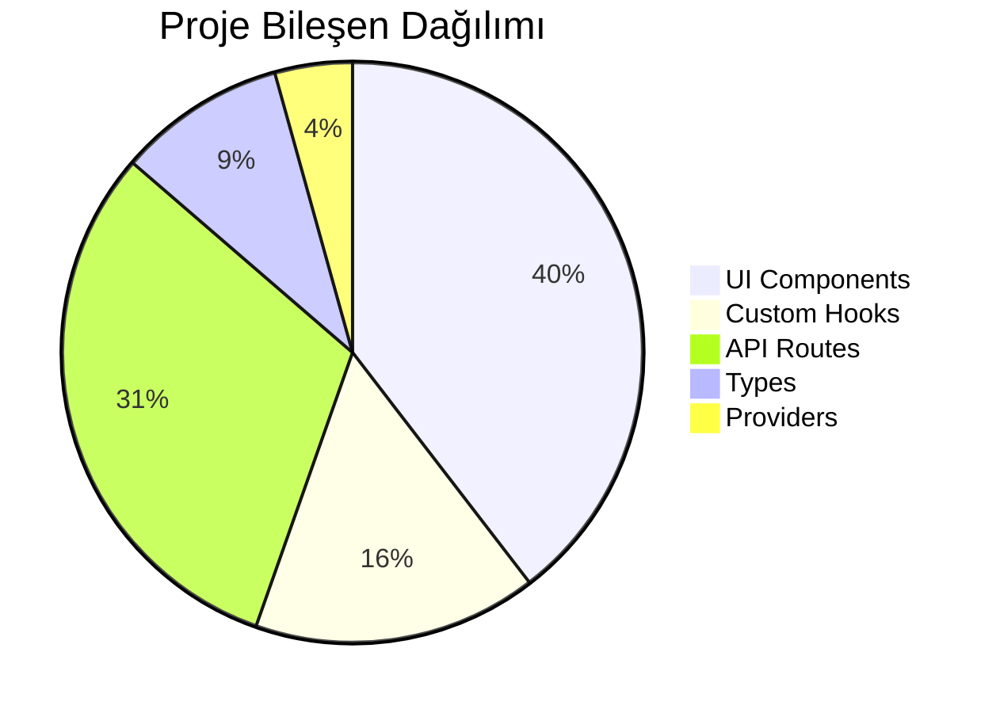

# BakirWebClient - Akademik Teknik Dokümantasyon

## İçindekiler

1. [Giriş ve Genel Bakış](#1-giriş-ve-genel-bakış)
2. [Teknoloji Yığını](#2-teknoloji-yığını)
3. [Mimari Tasarım](#3-mimari-tasarım)
4. [Güvenlik Mimarisi](#4-güvenlik-mimarisi)
5. [Bileşen Yapısı](#5-bileşen-yapısı)
6. [Gerçek Zamanlı İletişim](#6-gerçek-zamanlı-iletişim)
7. [State Yönetimi](#7-state-yönetimi)
8. [API Entegrasyonu](#8-api-entegrasyonu)
9. [Sonuç](#9-sonuç)

---

## 1. Giriş ve Genel Bakış

### 1.1 Proje Tanımı

**BakirWebClient**, mikroservis mimarisine dayalı bir bankacılık sisteminin kullanıcı arayüzü (frontend) bileşenidir. Bu proje, modern web teknolojileri kullanılarak geliştirilmiş olup, kullanıcıların bankacılık işlemlerini güvenli ve verimli bir şekilde gerçekleştirmelerini sağlayan kapsamlı bir web uygulamasıdır.

### 1.2 Projenin Kapsamı

Uygulama aşağıdaki temel işlevleri sunmaktadır:

| İşlev | Açıklama |
|-------|----------|
| **Kullanıcı Kimlik Doğrulama** | Güvenli giriş, kayıt ve oturum yönetimi |
| **Hesap Yönetimi** | Banka hesaplarının görüntülenmesi ve yönetimi |
| **Para Transferleri** | IBAN tabanlı para transferi işlemleri |
| **Kart Yönetimi** | Banka kartlarının listelenmesi ve yönetimi |
| **ATM Bulucu** | Harita üzerinde ATM lokasyonlarının gösterimi |
| **Analiz Raporları** | Finansal analiz ve raporlama |
| **Yapay Zeka Asistanı** | Doğal dil işleme tabanlı bankacılık asistanı |
| **Gerçek Zamanlı Bildirimler** | WebSocket tabanlı anlık bildirimler |

---

## 2. Teknoloji Yığını

### 2.1 Temel Framework ve Kütüphaneler



### 2.2 Teknoloji Detayları

| Kategori | Teknoloji | Versiyon | Kullanım Amacı |
|----------|-----------|----------|----------------|
| **Framework** | Next.js | 16.1.1 | Server-side rendering, routing |
| **UI Library** | React | 19.2.3 | Component-based UI |
| **Tip Güvenliği** | TypeScript | 5.x | Statik tip kontrolü |
| **Stil** | Tailwind CSS | 4.x | Utility-first CSS |
| **State** | Zustand | 5.0.6 | Global state management |
| **HTTP** | Axios | 1.11.0 | API istekleri |
| **WebSocket** | STOMP.js | 7.1.1 | Gerçek zamanlı iletişim |
| **Harita** | Mapbox GL | 3.14.0 | İnteraktif haritalar |
| **Validasyon** | Zod | 4.0.2 | Schema validasyonu |
| **Animasyon** | Framer Motion | 12.23.22 | UI animasyonları |
| **JWT** | Jose | 6.1.0 | Token işleme |

---

## 3. Mimari Tasarım

### 3.1 Genel Mimari Yapı



### 3.2 Klasör Yapısı

```
bakirwebclient/
├── app/                          # Next.js App Router
│   ├── (auth)/                   # Authentication sayfaları
│   │   ├── sign-in/              # Giriş sayfası
│   │   └── sign-up/              # Kayıt sayfası
│   ├── api/                      # Backend Proxy API Routes
│   │   ├── auth/                 # Kimlik doğrulama endpoints
│   │   ├── account/              # Hesap işlemleri
│   │   ├── transaction/          # Transfer işlemleri
│   │   ├── cards/                # Kart yönetimi
│   │   ├── atm/                  # ATM servisleri
│   │   ├── analysis/             # Analiz raporları
│   │   ├── chat/                 # AI Asistan
│   │   └── notification/         # Bildirimler
│   ├── dashboard/                # Ana kontrol paneli
│   ├── atmfinder/                # ATM bulucu sayfası
│   ├── cards/                    # Kart yönetim sayfası
│   ├── profile/                  # Kullanıcı profili
│   └── transactions/             # İşlem geçmişi
├── src/
│   ├── components/               # React bileşenleri
│   │   └── ui/                   # UI bileşenleri
│   ├── hooks/                    # Custom React hooks
│   ├── providers/                # Context providers
│   ├── services/                 # API servisleri
│   ├── types/                    # TypeScript tip tanımları
│   └── lib/                      # Yardımcı fonksiyonlar
├── middleware.ts                 # Route koruma middleware
└── public/                       # Statik dosyalar
```

---

## 4. Güvenlik Mimarisi

### 4.1 Güvenlik Katmanları



### 4.2 Middleware Katmanı

Middleware, tüm HTTP isteklerini yakalar ve route koruma mantığını uygular:

```typescript
// middleware.ts - Basitleştirilmiş Akış
export function middleware(request: NextRequest) {
    // 1. OPTIONS isteklerini geç (CORS preflight)
    if (request.method === 'OPTIONS') {
        return new NextResponse(null, { status: 200 });
    }

    // 2. Session token'ı cookie'den al
    const token = request.cookies.get('mb_session')?.value;

    // 3. Korumalı ve açık yolları tanımla
    const protectedPaths = ['/dashboard', '/profile', '/atmfinder'];
    const authPaths = ['/sign-in', '/sign-up'];

    // 4. Korumalı route - token yoksa login'e yönlendir
    if (isProtectedPath && !token) {
        return NextResponse.redirect('/sign-in');
    }

    // 5. Auth sayfasında token varsa dashboard'a yönlendir
    if (isAuthPath && token) {
        return NextResponse.redirect('/dashboard');
    }
}
```

### 4.3 Kimlik Doğrulama Akışı



### 4.4 Token Yönetimi

| Özellik | Açıklama |
|---------|----------|
| **Depolama** | HTTP-Only Cookie (XSS koruması) |
| **Cookie Adı** | `mb_session` |
| **Token Formatı** | JWT (JSON Web Token) |
| **Header Enjeksiyonu** | `Authorization: Bearer <token>` |
| **Otomatik Yenileme** | Token süresi dolduğunda yenileme |
| **Güvenli Silme** | Logout sırasında cookie temizleme |

### 4.5 Koruma Mekanizmaları Karşılaştırması

| Katman | Sorumluluk | Korunan Alanlar |
|--------|------------|-----------------|
| **Middleware** | İlk savunma hattı, route yönlendirme | Tüm HTTP istekleri |
| **AuthProvider** | Oturum durumu yönetimi | Tüm uygulama |
| **ProtectedRoute** | Sayfa seviyesi koruma | Korumalı sayfalar |
| **API Routes** | Backend proxy güvenliği | Tüm API istekleri |

---

## 5. Bileşen Yapısı

### 5.1 UI Bileşen Kategorileri



### 5.2 ATM Bulucu Bileşenleri

ATM Finder modülü, harita tabanlı ATM lokasyon sistemidir:

| Bileşen | Dosya | İşlev |
|---------|-------|-------|
| `Header` | `Header.tsx` | Navigasyon ve bildirim paneli |
| `PopUpMap` | `PopUpMap.tsx` | Mapbox harita entegrasyonu |
| `RouteTypeSelector` | `RouteTypeSelector.tsx` | Rota tipi seçimi |
| `AtmMarker` | `AtmMarker.tsx` | ATM konumu gösterimi |
| `AtmPopup` | `AtmPopup.tsx` | ATM detay popup'ı |

### 5.3 İşlem (Transaction) Bileşenleri

| Bileşen | İşlev |
|---------|-------|
| `AccountCreationForm` | Yeni hesap oluşturma formu |
| `TransferConfirmation` | Transfer onay ekranı |
| `TransactionHistory` | İşlem geçmişi listesi |
| `TransactionDetailModal` | İşlem detay modalı |

---

## 6. Gerçek Zamanlı İletişim

### 6.1 WebSocket Mimarisi



### 6.2 WebSocket Hook Yapısı

```typescript
// useWebSocket.ts - Temel Yapı
export function useWebSocket({ userId, onMessageReceived }) {
    const client = new Client({
        webSocketFactory: () => new SockJS(WS_URL),
        reconnectDelay: 5000,  // Otomatik yeniden bağlanma
        
        onConnect: () => {
            // Kullanıcıya özel topic'e abone ol
            client.subscribe(`/user/chat/model/${userId}/notifications`, 
                (message) => {
                    const body = JSON.parse(message.body);
                    
                    // Mesaj tipine göre işlem
                    if (body.type === 'MAINTENANCE') {
                        setMaintenance(body.isActive, body.message);
                    } else if (body.type === 'qr') {
                        // QR kod isteği işleme
                        window.dispatchEvent(new CustomEvent('qr-request', {...}));
                    }
                    
                    onMessageReceived?.(body);
                }
            );
        }
    });
}
```

### 6.3 Desteklenen Bildirim Tipleri

| Tip | Açıklama | Kullanım |
|-----|----------|----------|
| `MAINTENANCE` | Sistem bakım bildirimi | Bakım ekranı gösterimi |
| `qr` | QR kod transfer isteği | ATM'den para çekme |
| `chat` | AI asistan mesajları | Sohbet güncellemeleri |
| `notification` | Genel bildirimler | Kullanıcı bildirimleri |

---

## 7. State Yönetimi

### 7.1 Zustand State Mimarisi

```mermaid
graph TD
    subgraph "Global State Stores"
        A[authStore]
        B[notificationStore]
    end
    
    subgraph "authStore"
        A1[user: User | null]
        A2[isAuthenticated: boolean]
        A3[isLoading: boolean]
        A4[error: string | null]
    end
    
    subgraph "Eylemler"
        A5[login]
        A6[logout]
        A7[register]
        A8[checkAuth]
        A9[getCurrentUser]
    end
    
    A --> A1
    A --> A2
    A --> A3
    A --> A4
    A --> A5
    A --> A6
    A --> A7
```

### 7.2 Auth Store Yapısı

```typescript
// authStore.ts - Zustand Store
export const useAuthStore = create<AuthState>((set) => ({
    // State
    user: null,
    isLoading: true,
    error: null,
    isAuthenticated: false,

    // Actions
    login: async (email, password) => {
        set({ isLoading: true, error: null });
        const res = await fetch('/api/auth/sign-in', {...});
        set({ user: data.user, isAuthenticated: true });
    },
    
    logout: async () => {
        await logout();
        set({ user: null, isAuthenticated: false });
        window.location.href = '/';
    },
    
    getCurrentUser: async () => {
        const user = await getCurrentUser();
        set({ user, isAuthenticated: true });
    }
}));
```

### 7.3 Custom Hooks

| Hook | Dosya | Sorumluluk |
|------|-------|------------|
| `useAuth` | `useAuth.ts` | Kimlik doğrulama işlemleri |
| `useDashboard` | `useDashboard.ts` | Dashboard veri yönetimi |
| `useTransaction` | `useTransaction.ts` | Transfer işlemleri |
| `useChat` | `useChat.ts` | AI asistan sohbeti |
| `useWebSocket` | `useWebSocket.ts` | Gerçek zamanlı bağlantı |
| `useAtm` | `useAtm.ts` | ATM verileri |
| `useCards` | `useCards.ts` | Kart yönetimi |
| `useAccounts` | `useAccounts.ts` | Hesap işlemleri |

---

## 8. API Entegrasyonu

### 8.1 API Proxy Mimarisi



### 8.2 API Endpoint Kategorileri

#### Kimlik Doğrulama API'leri

| Endpoint | Method | Açıklama |
|----------|--------|----------|
| `/api/auth/sign-in` | POST | Kullanıcı girişi |
| `/api/auth/sign-up` | POST | Kullanıcı kaydı |
| `/api/auth/logout` | POST | Oturum sonlandırma |
| `/api/auth/check` | GET | Oturum kontrolü |

#### Hesap API'leri

| Endpoint | Method | Açıklama |
|----------|--------|----------|
| `/api/account/list` | POST | Hesap listesi |
| `/api/account/transaction/list` | POST | İşlem geçmişi |
| `/api/account/get-name-by-iban` | GET | IBAN'dan isim sorgulama |

#### Transfer API'leri

| Endpoint | Method | Açıklama |
|----------|--------|----------|
| `/api/transaction/transfer/atm` | POST | ATM transferi |
| `/api/transaction/deposit` | POST | Para yatırma |
| `/api/transaction/withdraw` | POST | Para çekme |

#### Diğer API'ler

| Endpoint | Method | Açıklama |
|----------|--------|----------|
| `/api/cards/list` | POST | Kart listesi |
| `/api/atm/*` | GET/POST | ATM servisleri |
| `/api/analysis/create` | POST | Analiz raporu oluşturma |
| `/api/analysis/list` | POST | Analiz listesi |
| `/api/chat` | POST | AI asistan |
| `/api/invoice/get` | POST | Fatura indirme |

### 8.3 Örnek API İstek/Yanıt Yapısı

```typescript
// useDashboard.ts - İşlem Listesi Çağrısı
const fetchTransactions = async (accountId, options) => {
    const response = await fetch('/api/account/transaction/list', {
        method: 'POST',
        credentials: "include",
        headers: { 'Content-Type': 'application/json' },
        body: JSON.stringify({
            accountId: accountId,
            page: options?.page ?? 0,
            size: options?.size ?? 5,
            type: options?.type,
            dateRange: options?.dateRange
        })
    });
    
    // Response: { transactions: Transaction[], totalPages: number }
    return await response.json();
};
```

---

## 9. Sonuç

### 9.1 Mimari Değerlendirme

**BakirWebClient** projesi, modern web geliştirme best practice'lerini takip eden, güvenli ve ölçeklenebilir bir frontend uygulamasıdır.

#### Güçlü Yönler

| Alan | Değerlendirme |
|------|---------------|
| **Güvenlik** | Çok katmanlı koruma (Middleware + AuthProvider + ProtectedRoute) |
| **Tip Güvenliği** | TypeScript ile derleme zamanı hata yakalama |
| **State Yönetimi** | Zustand ile basit ve etkili global state |
| **Gerçek Zamanlı** | WebSocket ile anlık bildirim desteği |
| **Kullanıcı Deneyimi** | Modern UI/UX, animasyonlar, responsive tasarım |
| **Harita Entegrasyonu** | Mapbox + Deck.gl ile gelişmiş görselleştirme |

#### Teknik Özellikler Özeti



### 9.2 Gelecek Geliştirme Önerileri

1. **PWA Desteği**: Progressive Web App özellikleri eklenerek offline kullanım
2. **Biometrik Kimlik Doğrulama**: WebAuthn entegrasyonu
3. **Çoklu Dil Desteği**: i18n implementasyonu
4. **Erişilebilirlik**: WCAG 2.1 standartlarına uyum
5. **Performance Monitoring**: Core Web Vitals takibi

---

## Kaynakça

1. Next.js Documentation - https://nextjs.org/docs
2. React 19 Documentation - https://react.dev
3. Zustand Documentation - https://docs.pmnd.rs/zustand
4. Mapbox GL JS - https://docs.mapbox.com/mapbox-gl-js
5. STOMP Protocol Specification - https://stomp.github.io/stomp-specification-1.2.html

---

*Bu dokümantasyon, BakirWebClient projesinin akademik analizi için hazırlanmıştır.*

**Hazırlayan**: Akademik Teknik Dokümantasyon  
**Tarih**: Ocak 2026  
**Versiyon**: 1.0
